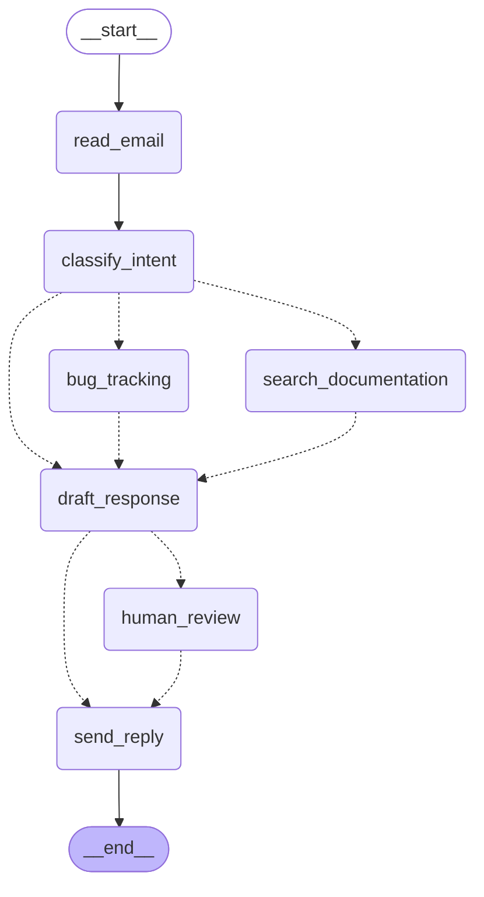

# CLAUDE.md

This file provides guidance to Claude Code (claude.ai/code) when working with code in this repository.

## Project Overview

LangGraph email agent implementation following the "Thinking in LangGraph" tutorial. Demonstrates state-based workflow design, Command-based routing, and human-in-the-loop with interrupt().

## Commands

```bash
make install   # Install dependencies (uv sync)
make check     # Format + lint (auto-fix)
make run       # Run the email agent demo
make test      # Verify imports work
make clean     # Remove caches, .DS_Store, *.pyc (preserves .venv)
```

## Architecture

### Core Pattern: State -> Nodes -> Commands

**ASCII Graph** (generate with `agent.get_graph().draw_ascii()`):

```bash
                                +-----------+
                                | __start__ |
                                +-----------+
                                       *
                                       *
                                       *
                                +------------+
                                | read_email |
                                +------------+
                                       *
                                       *
                                       *
                              +-----------------+
                              | classify_intent |
                           ...+-----------------+...
                     ......            .            ......
                .....                  .                  .....
             ...                       .                       .....
+--------------+           +----------------------+                 ...
| bug_tracking |           | search_documentation |            .....
+--------------+.....      +----------------------+       .....
                     ......            .            ......
                           .....       .       .....
                                ...    .    ...
                              +----------------+
                              | draft_response |
                              +----------------+
                                ..           ..
                              ..               ..
                            ..                   ..
                  +--------------+                 ..
                  | human_review |               ..
                  +--------------+             ..
                                ..           ..
                                  ..       ..
                                    ..   ..
                                +------------+
                                | send_reply |
                                +------------+
                                       *
                                       *
                                       *
                                  +---------+
                                  | __end__ |
                                  +---------+
```

**Mermaid Diagram** (generate with `agent.get_graph().draw_mermaid()`):



**Edge types**: Solid (`-->`) = explicit edges via `add_edge()`. Dashed (`-.->`) = conditional edges inferred from `Command` routing

**State** (`EmailAgentState`): TypedDict that flows between nodes. Stores raw data, not formatted prompts.

**Nodes**: Functions that take state, do work, return updates. Two return types:

- `dict`: Simple state update, routing follows explicit edges
- `Command`: State update + routing decision bundled together

**Command-based routing**: Nodes decide where to go next via `Command(update={...}, goto="node_name")`. Only 3 explicit edges defined; all conditional routing lives in nodes.

### Key Files

- `email_agent.py`: State schema, node functions, graph wiring
- `run_agent.py`: Demo script showing invoke, stream, and interrupt handling

### Human-in-the-Loop Pattern

1. Node calls `interrupt(payload)` - execution pauses, state saved
2. Caller checks `agent.get_state(config).next` for pending nodes
3. Access payload via `state.tasks[n].interrupts[m].value`
4. Resume with `agent.stream(Command(resume={...}), config)`

### Environment

Requires `OPENAI_API_KEY` in `.env` file.

### Default Model

The default model is `gpt-5-nano`.
