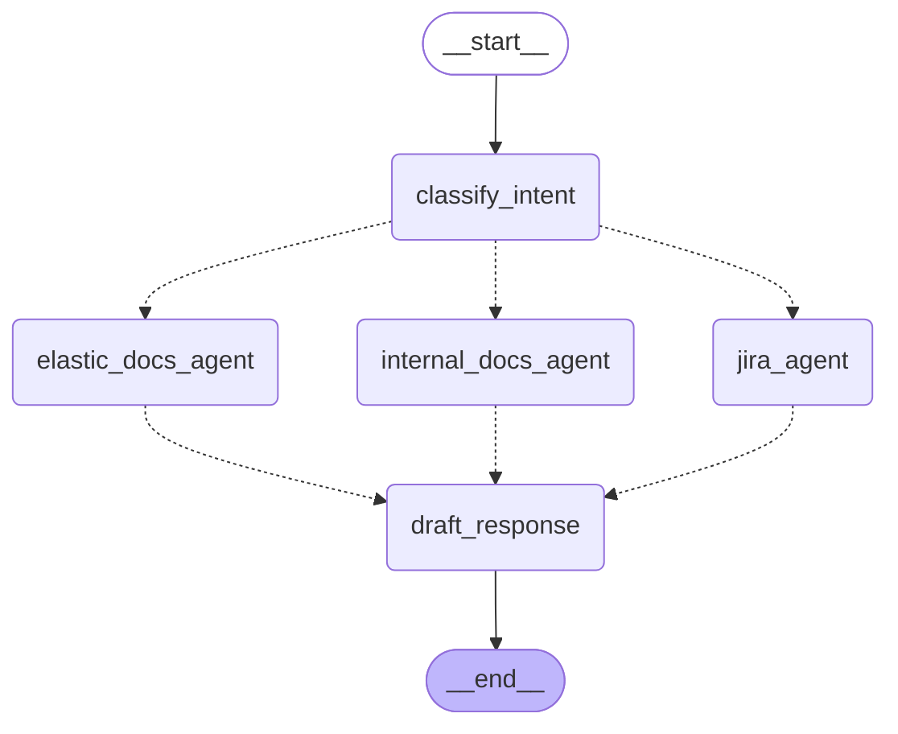

# Enterprise RAG

Intent-based Retrieval-Augmented Generation system built with LangGraph.

## Overview

This system classifies user queries and routes them to specialized retrieval agents:

| Intent          | Description                  | Data Sources     |
| --------------- | ---------------------------- | ---------------- |
| `internal_docs` | Company processes, policies  | Wiki, ServiceNow |
| `elastic_docs`  | Elasticsearch/Kibana usage   | Official ES docs |
| `jira`          | Bug status, feature requests | Elastic Jira     |

## Architecture



## Quick Start

```bash
# Install dependencies
make install

# Set up environment
echo "OPENAI_API_KEY=your-key-here" > .env

# Run the demo
make run
```

## Example Output

```bash
QUERY: How do I submit a PTO request?

[classify_intent]
  Intent: internal_docs
  Reasoning: User is asking about internal company processes...

[internal_docs_agent]
  Retrieved 3 chunks:
    - [wiki] Internal Guide: PTO Request (score: 0.92)
    - [servicenow] How To: Standard Process Guide (score: 0.85)
    - [wiki] Related Policies and Procedures (score: 0.78)

[draft_response]
  Response: To submit a PTO request, navigate to the portal...

  Sources:
    - [wiki] Internal Guide: PTO Request
    - [servicenow] How To: Standard Process Guide
```

## Commands

| Command              | Description              |
| -------------------- | ------------------------ |
| `make install`       | Install dependencies     |
| `make check`         | Format + lint (auto-fix) |
| `make test`          | Run tests                |
| `make run`           | Run the demo             |
| `make graph-ascii`   | Print ASCII graph        |
| `make graph-mermaid` | Print Mermaid diagram    |
| `make clean`         | Remove caches            |

## Project Structure

```bash
src/
├── enterprise_rag/
│   ├── state.py          # State schemas
│   ├── config.py         # Configuration
│   ├── graph.py          # LangGraph wiring
│   ├── nodes/
│   │   ├── classifier.py # Intent classification
│   │   └── response.py   # Response generation
│   └── agents/
│       ├── internal_docs.py
│       ├── elastic_docs.py
│       └── jira.py
└── main.py
```

## Configuration

Environment variables:

| Variable               | Description              | Default      |
| ---------------------- | ------------------------ | ------------ |
| `OPENAI_API_KEY`       | OpenAI API key           | Required     |
| `CLASSIFIER_MODEL`     | Model for classification | gpt-4.1-nano |
| `RESPONSE_MODEL`       | Model for response       | gpt-4.1-nano |
| `MAX_CHUNKS_PER_AGENT` | Max chunks per retrieval | 5            |

## Extending

To add a new data source:

1. Create agent in `src/enterprise_rag/agents/`
2. Add intent to `IntentType` in `state.py`
3. Update classifier prompt in `nodes/classifier.py`
4. Register node in `graph.py`

## Tech Stack

- [LangGraph](https://langchain-ai.github.io/langgraph/) - Workflow orchestration
- [LangChain](https://python.langchain.com/) - LLM integration
- [OpenAI](https://openai.com/) - Language models
- [uv](https://github.com/astral-sh/uv) - Package management
