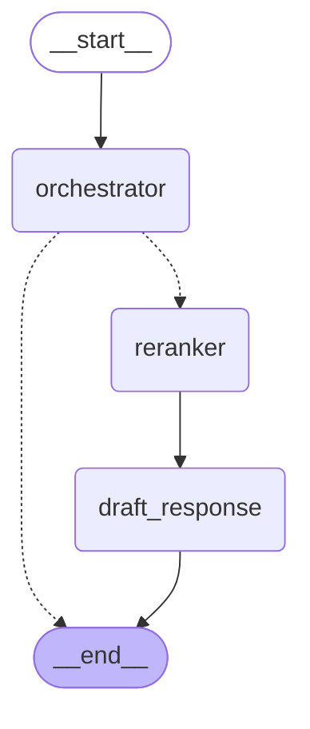

# Enterprise RAG

Tool-based Retrieval-Augmented Generation system built with LangGraph.

## Overview

This system uses an **orchestrator LLM with bound tools** to handle user queries. The orchestrator decides which search tools to call and with what focused queries, naturally decomposing multi-intent queries.

| Tool                  | Description                  | Data Sources           |
| --------------------- | ---------------------------- | ---------------------- |
| `search_internal_docs`| Company processes, policies  | Wiki, ServiceNow       |
| `search_elastic_docs` | Elasticsearch/Kibana usage   | Official ES docs       |
| `search_jira`         | Bug status, feature requests | Jira                   |

**Multi-intent support**: A single query triggers multiple tool calls with focused queries. For example:

- Query: "What's the PTO policy and how do I set up Elasticsearch?"
- Orchestrator calls:
  - `search_internal_docs("PTO policy")`
  - `search_elastic_docs("Elasticsearch setup")`

Each tool gets a focused query, avoiding search pollution.

**General queries**: Greetings and chitchat are handled directly by the orchestrator without calling any tools.

## Architecture

### Graph Flow



```text
                +-----------+
                | __start__ |
                +-----------+
                      *
                      *
                      *
              +--------------+
              | orchestrator |
              +--------------+
               ..           ...
             ..                ..
           ..                    ..
   +----------+                    ..
   | reranker |                     .
   +----------+                     .
         *                          .
         *                          .
         *                          .
+----------------+                 ..
| draft_response |               ..
+----------------+             ..
               **           ...
                 **       ..
                   **   ..
                 +---------+
                 | __end__ |
                 +---------+
```

**Three nodes**:

1. **orchestrator** - LLM with bound tools decides what to search, executes tools in parallel
2. **reranker** - Cross-source Jina reranking of all retrieved chunks
3. **draft_response** - Generates final response with citations

**Routing**:

- If orchestrator calls tools: results go to reranker
- If orchestrator responds directly (greetings): exits to END

### Two-Stage Retrieval Pipeline

Each tool retrieves candidates, then the reranker cross-source ranks all results:

```text
Stage 1: Recall (per-tool, Elasticsearch)
├── Hybrid Search (BM25 + kNN + RRF)
├── Keyword Search (LLM-extracted keywords, parallel)
└── Merge and dedupe candidates

Stage 2: Precision (reranker node, Jina)
└── Cross-encoder rerank across ALL sources -> top 8
```

Field weights: `page_content` (1.0), `title` (0.5), `keywords` (0.2), `summary` (0.2)

## Quick Start

```bash
# Install dependencies
make install

# Set up environment
cp .env.example .env
# Edit .env with your credentials:
# - AZURE_OPENAI_ENDPOINT, AZURE_OPENAI_API_KEY (LLM + embeddings)
# - JINA_API_KEY (reranking)
# - ELASTICSEARCH_URL, ELASTICSEARCH_API_KEY (retrieval)

# Install pre-commit hooks
make pre-commit-install

# Run the demo
make run
```

## Example Output

### Single Intent

```text
QUERY: How do I submit a PTO request?

[orchestrator]
  Tool calls: search_internal_docs("PTO request process")

[reranker]
  Reranked to 8 final chunks

[draft_response]
  Response:
  How to submit a PTO request:
  - Navigate to the portal
  - Fill out the required form
  - Submit for approval

  ## Sources
  - [Internal Guide: PTO Request](https://wiki.example.com/pto)
```

### Multi-Intent (Parallel Tools)

```text
QUERY: What's the PTO policy? And how do I connect Otel to Elasticsearch?

[orchestrator]
  Tool calls:
    - search_internal_docs("PTO policy")
    - search_elastic_docs("OpenTelemetry Elasticsearch connection")

[reranker]
  Reranked 30 chunks -> 8 final (cross-source)

[draft_response]
  Response combines information from both sources with proper citations.
```

### General (No Retrieval)

```text
QUERY: Hello!

[orchestrator]
  No tool calls - direct response
  Response: Hello! I'm here to help. Ask about company policies, ES docs, or Jira issues.
```

## Commands

| Command                       | Description                    |
| ----------------------------- | ------------------------------ |
| `make install`                | Install dependencies           |
| `make check`                  | Format + lint (auto-fix)       |
| `make test`                   | Run tests                      |
| `make run`                    | Run demo queries               |
| `make run QUERY="your query"` | Run a custom query             |
| `make pre-commit-install`     | Install git pre-commit hooks   |
| `make pre-commit`             | Run all pre-commit hooks       |
| `make graph-ascii`            | Print ASCII graph              |
| `make graph-mermaid`          | Print Mermaid diagram          |
| `make clean`                  | Remove caches                  |

## Project Structure

```text
src/
├── enterprise_rag/
│   ├── state.py          # State schemas (with reducer for parallel accumulation)
│   ├── config.py         # Configuration (pydantic-settings)
│   ├── graph.py          # LangGraph wiring
│   ├── search.py         # Elasticsearch hybrid search + Jina reranking
│   ├── nodes/
│   │   ├── orchestrator.py  # LLM + tool orchestration
│   │   ├── reranker.py      # Cross-source reranking
│   │   └── response.py      # Response generation
│   └── tools/
│       └── __init__.py      # Search tools (internal_docs, elastic_docs, jira)
└── main.py
```

## Configuration

Create a `.env` file with the following variables:

### Azure OpenAI (required)

| Variable                          | Description                 |
| --------------------------------- | --------------------------- |
| `AZURE_OPENAI_ENDPOINT`           | Azure OpenAI service URL    |
| `AZURE_OPENAI_API_KEY`            | Azure OpenAI API key        |
| `AZURE_EMBEDDING_DEPLOYMENT_NAME` | Embedding deployment name   |

The system uses Azure OpenAI via the v1 API pattern (`/openai/v1/` endpoint) for full `ChatOpenAI` compatibility with reasoning models.

### LLM Settings

| Variable                      | Description                        | Default    |
| ----------------------------- | ---------------------------------- | ---------- |
| `CLASSIFIER_MODEL`            | Model for orchestrator + keywords  | gpt-5-nano |
| `RESPONSE_MODEL`              | Model for response generation      | gpt-5-nano |
| `RESPONSE_REASONING_EFFORT`   | Reasoning effort (low/medium/high) | medium     |
| `TIMEOUT_SECONDS`             | Request timeout                    | 90         |

### Elasticsearch (retrieval)

| Variable                | Description                |
| ----------------------- | -------------------------- |
| `ELASTICSEARCH_URL`     | Elasticsearch cluster URL  |
| `ELASTICSEARCH_API_KEY` | API key for authentication |
| `WIKI_ES_VECTOR_INDEX`  | Wiki embeddings index      |
| `DOCS_ES_VECTOR_INDEX`  | ES docs embeddings index   |

### Jina AI (reranking)

| Variable       | Description                            |
| -------------- | -------------------------------------- |
| `JINA_API_KEY` | Jina API key (get at jina.ai)          |
| `RERANK_MODEL` | Model name (default: jina-reranker-v3) |
| `RERANK_TOP_N` | Results after rerank (default: 8)      |

### Retrieval Settings

| Variable      | Description                            |
| ------------- | -------------------------------------- |
| `CANDIDATE_K` | Candidates before rerank (default: 15) |

### LangSmith (observability)

| Variable            | Description                 |
| ------------------- | --------------------------- |
| `LANGSMITH_TRACING` | Enable tracing (true/false) |
| `LANGSMITH_API_KEY` | LangSmith API key           |
| `LANGSMITH_PROJECT` | Project name for tracing    |

See `src/enterprise_rag/CLAUDE.md` for full configuration reference.

## Extending

To add a new data source:

1. Add tool function in `src/enterprise_rag/tools/__init__.py`
2. Include in `ALL_TOOLS` list
3. Update orchestrator system prompt in `nodes/orchestrator.py`
4. Update `src/enterprise_rag/tools/CLAUDE.md` with tool details

See the tool contract in `tools/CLAUDE.md` for implementation patterns.

## Async Execution

The system is fully async for FastAPI deployment:

```python
import asyncio
from enterprise_rag import create_rag_graph

async def main():
    graph = create_rag_graph()
    result = await graph.ainvoke({"query": "How do I submit PTO?"})
    print(result["response"])

asyncio.run(main())
```

All nodes and tools use `async def` with `await llm.ainvoke()` for non-blocking execution.

## Pre-commit Hooks

The project uses pre-commit hooks to ensure code quality:

| Hook                   | Purpose                        |
| ---------------------- | ------------------------------ |
| `end-of-file-fixer`    | Ensures files end with newline |
| `trailing-whitespace`  | Removes trailing whitespace    |
| `check-ast`            | Validates Python syntax        |
| `ruff-format`          | Auto-formats Python            |
| `ruff`                 | Lints + auto-fixes Python      |
| `markdownlint-fix`     | Auto-fixes markdown            |
| `pytest`               | Runs test suite                |

```bash
make pre-commit-install  # One-time setup
make pre-commit          # Run all hooks manually
```

## Tech Stack

- [LangGraph](https://langchain-ai.github.io/langgraph/) - Workflow orchestration (async)
- [LangChain](https://python.langchain.com/) - LLM integration with tool calling
- [Azure OpenAI](https://azure.microsoft.com/en-us/products/ai-services/openai-service) - Language models + embeddings
- [Elasticsearch](https://www.elastic.co/) - Hybrid search (BM25 + kNN + RRF)
- [Jina AI](https://jina.ai/reranker/) - Cross-encoder reranking
- [uv](https://github.com/astral-sh/uv) - Package management
- [pre-commit](https://pre-commit.com/) - Git hooks framework
